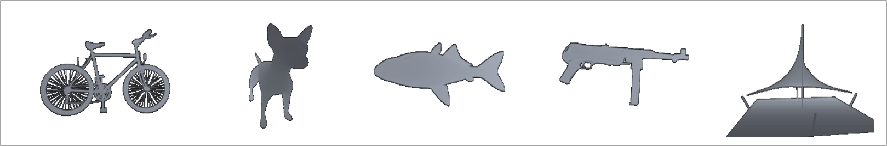
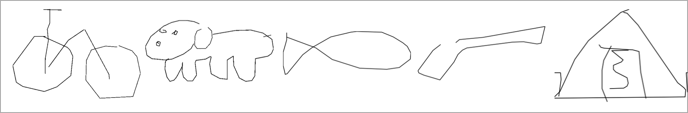

# doodle2object(D2O)
A practical dataset for sketch-based 3D shape retrieval(SBSR). It includes 8,992 3D shapes (with a guaranteed sample size of at least 30 per category) and over 7 million sketches, divided into 50 categories.

This repository provides the original **bin** file of the quickdraw style sketches and some tools that may be used for data pre-processing.

The full dataset could be downloaded at \[ https://pan.baidu.com/s/1WSsJmn0xnE97iV_V-VpyfQ \] with the password **x748**

you can cite the following paper to use this dataset:
`Wang B, Zhou Y. Doodle to object: practical zero-shot sketch-based 3D shape retrieval[C]//Proceedings of the AAAI Conference on Artificial Intelligence. 2023, 37(2): 2474-2482.`
